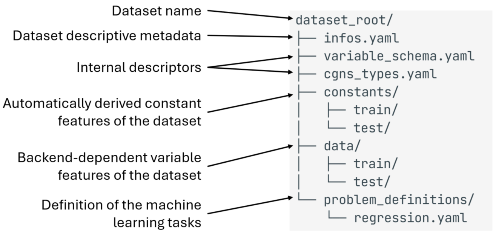

# Summary

PLAID (Physics-Learning AI Datamodel) is a Python library and data format for representing, storing, and sharing physics simulation datasets for machine learning. Unlike domain-specific formats, PLAID accommodates time-dependent, multi-resolution simulations and heterogeneous meshes. The library provides a high-level API to easily load, inspect, and save data. Beyond basic I/O, PLAID adopts a backend-oriented storage design supporting several backends (`cgns`, `hf_datasets`, and `zarr`), and integrates with the Hugging Face Hub to push and pull datasets. It also ships command-line tools to check, serve, and interactively visualize datasets. In short, PLAID couples a flexible on-disk standard with a software toolkit to manipulate physics data, addressing the needs of ML researchers in fluid dynamics, structural mechanics, and related fields in a generic fashion. Full documentation, examples and tutorials are available at [plaid-lib.readthedocs.io](https://plaid-lib.readthedocs.io/en/latest/).

# Statement of Need

Machine learning for physical systems often suffers from inconsistent data representations across different domains and simulators.  Existing initiatives typically target narrow problems: e.g., separate formats for CFD or for finite-element data, and dedicated scripts to process each new dataset. This fragmentation hinders reproducibility and reuse of high-fidelity data.

In practice, simulation datasets for machine-learning workflows are often distributed through general-purpose scientific formats such as HDF5 or visualization-oriented formats such as VTK, combined with project-specific conventions. While several recent benchmark initiatives (e.g., The Well [@ohana2024well], PDEBench [@pdebench], PDEArena [@pdearena]) standardize tasks and evaluation metrics for physics-informed ML, they typically rely on bespoke data organizations rather than a shared datamodel. As a result, interoperability and reuse across datasets and simulators remain limited.

PLAID addresses this gap by providing a generic, unified datamodel that can describe many types of physics simulation data.  It leverages the CGNS standard [@poinot2018seven] to capture complex geometry and time evolution: for example, CGNS supports multi-block topologies and evolving meshes, with a data model that separates abstract topology (element families, etc.) from concrete mesh coordinates.  On top of CGNS, PLAID layers a lightweight organizational structure.

By promoting a common standard, PLAID makes physics data interoperable across projects. It has already been used to package and publish multiple datasets covering structural mechanics and computational fluid dynamics. These PLAID-formatted datasets (hosted on Hugging Face) have supported ML benchmarks, democratizing access to simulation data.

# Functionality

* **Data Model and Formats:** A PLAID dataset is organized within a root folder that separates shared dataset metadata from split-specific data payloads, as illustrated in \autoref{fig:plaid_dataset_architecture}. At the root, `infos.yaml` stores global metadata (owner, license, storage backend, number of samples per split). For non-CGNS backends, `variable_schema.yaml` and `cgns_types.yaml` describe the structure and typing of per-sample features, while the `constants/<split>/` directories store split-level constant features. For the `cgns` backend, samples are stored as complete CGNS trees and these derived metadata files are intentionally omitted. In all cases, the `data/<split>/` directories store the backend-specific sample payloads for each split (e.g., `train`, `test`). The optional `problem_definitions/` folder provides machine learning context through serialized `ProblemDefinition` files (YAML), each specifying task inputs and outputs. This design supports time evolution and multi-block/multi-geometry problems out of the box.

{ width=80% }

* **Supported Data Types:** PLAID handles mesh-based fields together with named global values attached to each sample. These global values can be time-dependent and may be scalars, strings, or arrays/tensors of arbitrary order, making them suitable for parameters, boundary conditions, labels, or other sample-level quantities. Each `Sample` wraps a CGNS tree; methods such as `get_all_time_values()`, `get_feature_by_path(path, time)`, `get_field(...)`, and `show_tree(time)` give access to per-timestep data. Thus PLAID naturally supports mesh-based simulation outputs with arbitrary element types and remeshing between time steps. Heterogeneity is allowed: missing data is supported, and outputs on testing sets may be missing on purpose to facilitate benchmark initiatives.

* **High-Level API:** PLAID follows a backend-oriented design rather than loading a whole dataset into a single in-memory object. The public classes are `Sample`, `ProblemDefinition`, and `Infos`. Reading is centered on the `plaid.storage` module: `init_from_disk(local_folder)` returns per-split backend datasets together with converter objects, and individual samples are materialized lazily via `converter.to_plaid(dataset, i)`. Problem definitions are loaded with `load_problem_definitions_from_disk(...)`. Writing is handled by `save_to_disk(...)`, to which the user supplies a `sample_constructor(id) -> Sample` callable and a mapping of split names to sample identifiers; PLAID takes care of iteration, schema extraction, and optional parallel sample generation across processes. Datasets can then be published with `push_to_hub(...)` and streamed directly from the Hub via `init_streaming_from_hub(...)`. This interface abstracts away low-level I/O and works uniformly across backends and heterogeneous data.

* **Storage Backends and Hub Integration:** PLAID supports multiple interchangeable storage backends: `cgns` (each sample stored as a complete CGNS tree), `hf_datasets`, and `zarr`. The `plaid.storage` module provides a unified interface for saving to disk, pushing to and downloading from the Hugging Face Hub, and streaming datasets. The package also ships three command-line tools: `plaid-check` (validate the on-disk layout and perform integrity checks on metadata, samples, and problem definitions); `plaid-serve` (run a lightweight read-only HTTP server that exposes a local dataset's metadata, problem definitions, and samples to client tools and the ParaView plugin, intended for local or trusted-network use); and `plaid-viewer` (a browser-based interactive viewer for exploring dataset samples, meshes, and fields).

# Usage and Applications

PLAID is designed for AI/ML researchers and practitioners working with simulation data. Various datasets, including 2D/3D fluid and structural simulations, are provided in PLAID format on [Hugging Face](https://huggingface.co/PhysArena). Interactive benchmarks are hosted in a [Hugging Face community](https://huggingface.co/PLAIDcompetitions) on these datasets, providing detailed instructions and PLAID commands for data retrieval and manipulation, see @casenave2026plaidunifieddatamodel. These datasets are also used in recent publications to illustrate the performance of the proposed scientific ML methods. @casenave2024mmgp and Kabalan et al. [-@kabalan2025elasticity; -@kabalan2025ommgp] apply Gaussian-process regression methods with mesh morphing to these datasets. Carpintero Perez et al. [-@perez2024gaussian; -@perez2024learning] apply graph-kernel regression methods to these datasets in fluid and solid mechanics.

In summary, PLAID provides a comprehensive framework for physics-based ML data. By combining a unified data model, support for advanced mesh features, and helpful utilities, it addresses the need for interoperable, high-fidelity simulation datasets. Future enhancements involve developing general-purpose PyTorch data loaders compatible with PLAID, along with establishing standardized evaluation metrics and unified pipelines for training and inference using the PLAID framework.

# References