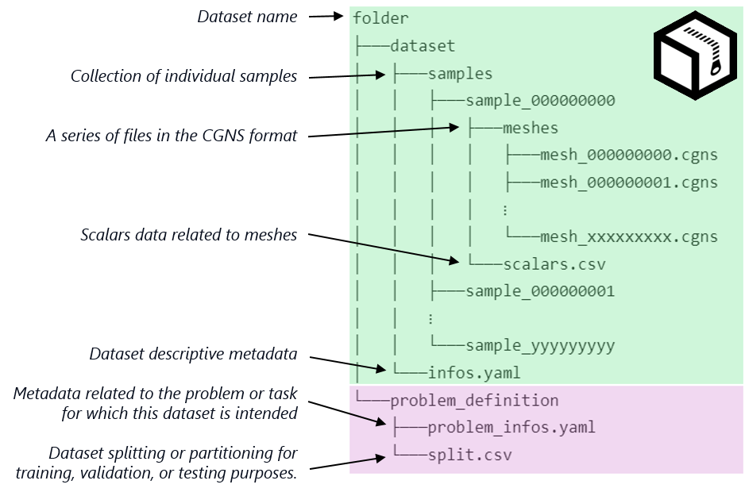

# Summary

PLAID (Physics-Learning AI Datamodel) is a Python library and data format for representing, storing, and sharing physics simulation datasets for machine learning. Unlike domain-specific formats, PLAID accommodates time-dependent, multi-resolution simulations and heterogeneous meshes. The library provides a high-level API to easily load, inspect, and save data. Beyond basic I/O, PLAID includes utilities for machine-learning workflows. It provides converters to build PLAID datasets from generic tabular data, and a “Hugging Face bridge” to push/pull datasets via the Hugging Face hub. In short, PLAID couples a flexible on-disk standard with a software toolkit to manipulate physics data, addressing the needs of ML researchers in fluid dynamics, structural mechanics, and related fields in a generic fashion. Full documentation, examples and tutorials are available at [plaid-lib.readthedocs.io](https://plaid-lib.readthedocs.io/en/latest/).

# Statement of Need

Machine learning for physical systems often suffers from inconsistent data representations across different domains and simulators.  Existing initiatives typically target narrow problems: e.g., separate formats for CFD or for finite-element data, and dedicated scripts to process each new dataset. This fragmentation hinders reproducibility and reuse of high-fidelity data.

PLAID addresses this gap by providing a generic, unified datamodel that can describe many physics simulation data.  It leverages the CGNS standard [@poinot2018seven] to capture complex geometry and time evolution: for example, CGNS supports multi-block topologies and evolving meshes, with a data model that separates abstract topology (element families, etc.) from concrete mesh coordinates.  On top of CGNS, PLAID layers a lightweight organizational structure.

By promoting a common standard, PLAID makes physics data interoperable across projects. It has already been used to package and publish multiple datasets covering structural mechanics and computational fluid dynamics. These PLAID-formatted datasets (hosted on Zenodo and Hugging Face) have supported ML benchmarks, democratizing access to simulation data.

# Functionality

* **Data Model and Formats:** A PLAID dataset is organized within a root folder (or archive), distinctly separating simulation data from machine learning task definitions, as illustrated in \autoref{fig:plaid_dataset_architecture}. The `dataset/` directory contains numbered sample subfolders (`sample_000...`), each holding one or more `.cgns` files under `meshes/` and a `scalars.csv` file. The `dataset/infos.yaml` file contains human-readable descriptions and metadata.  The `problem_definition/` folder provides machine learning context. It includes `problem_infos.yaml` (specifying the ML task inputs/outputs) and `split.csv` (defining train/test splits).  This design supports time evolution and multi-block/multi-geometry problems out of the box.

{ width=80% }

* **Supported Data Types:** PLAID handles scalar, time-series and vector field data on meshes, as well as sample-specific metadata. The `get_mesh(time)` method reconstructs the full CGNS tree for a given timestep, with links resolved if requested (thereby returning the complete mesh). Thus PLAID naturally supports mesh-based simulation outputs with arbitrary element types and remeshing between time steps. Heterogeneity is allowed: missing data is supported, and outputs on testing sets may be missing on purpose to facilitate benchmark initiatives.

* **High-Level API:** The top-level `Dataset` class manages multiple `Sample` objects. Users can create an empty `Dataset()` and add samples via `add_sample()`, or load an existing PLAID data archive by calling `Dataset("path_to_plaid_dataset")`. The `Dataset` object summarizes itself (e.g. printing “Dataset(3 samples, 2 scalars, 5 fields)”) and provides access to samples by ID. Batch operations are supported: one can `dataset.add_samples(...)` to append many samples, or use the classmethods `Dataset.load_from_dir()` and `load_from_file()` to load data from disk, with optional parallel workers. This high-level interface abstracts away low-level I/O, letting users focus on ML pipelines.

* **Utilities:** PLAID includes helper modules for common tasks in data science workflows. The `plaid.utils.split` module provides a `split_dataset` function to partition data into training/validation/testing subsets according to user-defined ratios. The `plaid.utils.interpolation` module implements piecewise linear interpolation routines to resample time series fields or align datasets with different timesteps. The `plaid.utils.stats` module offers an `OnlineStatistics` class to compute running statistics (min, mean, variance, etc.) on arrays, which can be used to analyze dataset distributions. Moreover, a “Hugging Face bridge” (`plaid.bridges.huggingface_bridge`) enables converting PLAID datasets to/from Hugging Face Dataset objects.

# Usage and Applications

PLAID is designed for AI/ML researchers and practitioners working with simulation data. Various datasets, including 2D/3D fluid and structural simulations, are provided in PLAID format in [Hugging Face](https://huggingface.co/PLAID-datasets) and [Zenodo](https://zenodo.org/communities/plaid_datasets). Interactive benchmarks are hosted in a [Hugging Face community](https://huggingface.co/PLAIDcompetitions) on these datasets, providing detailed instructions and PLAID commands for data retrieval and manipulation, see [@casenave2025physics]. These datasets are also used in recent publications to illustrate the performance of the proposed scientific ML methods. In [@casenave2024mmgp; @kabalan2025elasticity; @kabalan2025ommgp],  Gaussian-process regression methods with mesh morphing are applied to these datasets. In [@perez2024gaussian; @perez2024learning] the datasets are leveraged in graph-kernel regression methods applied to fluid/solid mechanics.

In summary, PLAID provides a comprehensive framework for physics-based ML data. By combining a unified data model, support for advanced mesh features, and helpful utilities, it addresses the need for interoperable, high-fidelity simulation datasets. Future enhancements involve developing general-purpose PyTorch dataloaders compatible with PLAID, along with establishing standardized evaluation metrics and unified pipelines for training and inference using the PLAID framework.

# References
