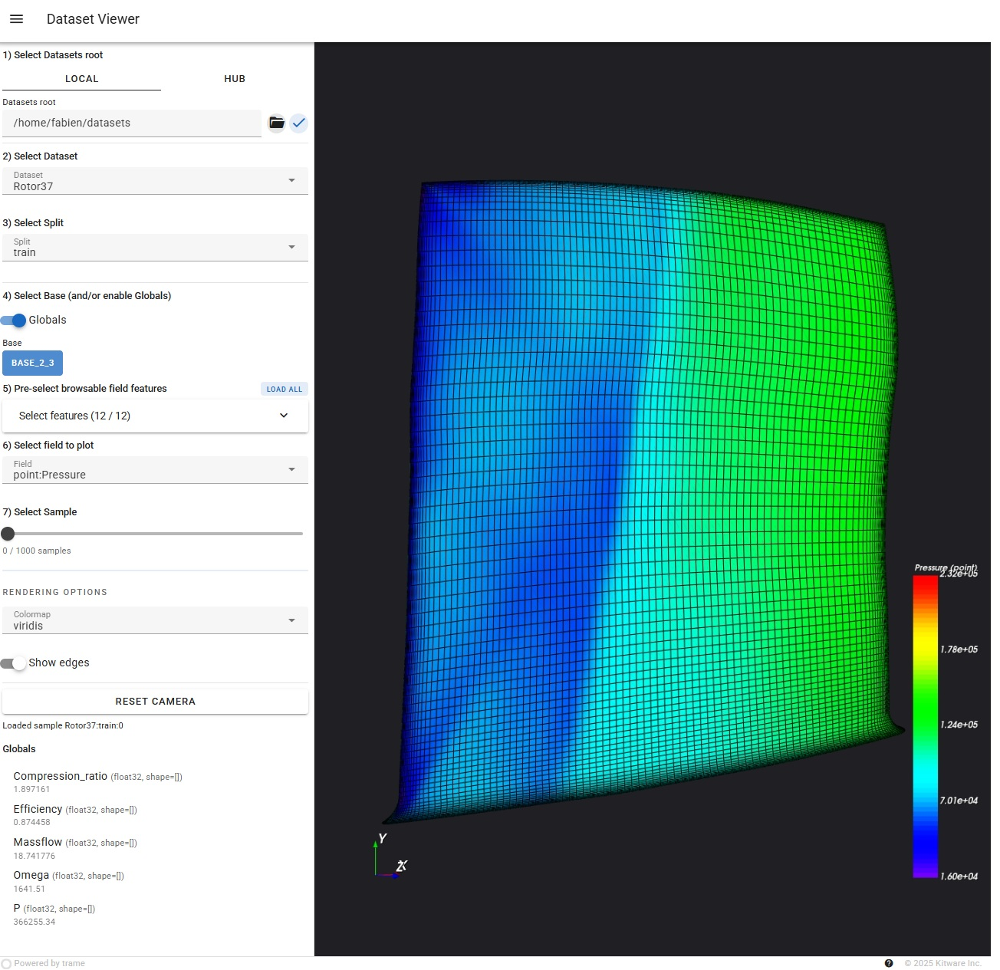

# Dataset viewer

`plaid-viewer` is a small web application for opening a PLAID dataset and
looking at its samples in 3D. It is meant for exploration: choose where the
data comes from, choose what part of the sample you want to see, then inspect
the mesh and fields interactively.

## Start the viewer

From a terminal, run:

```bash
uv run plaid-viewer
```

You can also start directly from a local datasets folder:

```bash
uv run plaid-viewer --datasets-root /path/to/datasets
```

Then open the address shown by the command, usually:

```text
http://127.0.0.1:8080/
```

Useful launch options:

| Option | What it does |
| --- | --- |
| `--datasets-root /path/to/datasets` | Opens a local folder containing PLAID datasets. |
| `--hub-repo namespace/name` | Adds a Hugging Face Hub dataset to stream. Can be repeated. |
| `--host 0.0.0.0` | Makes the viewer reachable from another machine. |
| `--port 8080` | Changes the web server port. |

## Follow the steps in the side panel



The left panel is numbered in the same order as a typical workflow.

### 1) Select Datasets root

Choose where the datasets come from.

- **Local**: enter the path to a folder on your computer. You can also click
  the folder button to browse, then validate with the check button.
- **Hub**: enter a Hugging Face Hub repository name such as
  `PLAID-lib/VKI-LS59`, then click the plus button. Added Hub datasets appear
  as chips and can be removed from the same area.

If you started the viewer with `--datasets-root` or `--hub-repo`, this step may
already be filled in.

### 2) Select Dataset

Pick the dataset you want to inspect.

The list depends on the tab selected in step 1: local datasets are shown on the
**Local** tab, while streamed Hub datasets are shown on the **Hub** tab.

### 3) Select Split

Choose the dataset split, for example `train`, `test`, or any other split
provided by the dataset.

### 4) Select Base (and/or enable Globals)

Choose which high-level part of the sample to load.

- Click a **Base** button to display the mesh for that base.
- Enable **Globals** if you want to load and display global values associated
  with the sample.

By default, the viewer starts light: it does not load every field immediately.
Pick a base and/or enable globals first, then choose fields in the next steps.

### 5) Pre-select browsable field features

This step is shown when the local dataset exposes selectable fields.

Use it to choose which fields should be loaded for the selected base. This is
useful for large datasets because you can avoid loading everything at once.

- Click **Load all** to load every available field for the current selection.
- Expand **Select features** to tick only the fields you need.
- Click **Apply** after changing the checked fields.
- Click **Clear** to uncheck the current selection.

For streamed Hub datasets, this panel can be hidden because samples are loaded
progressively from the stream.

### 6) Select field to plot

Choose the field used to color the 3D view.

If no field is selected, the viewer still shows the mesh, but without scalar
coloring. When a field is selected, a color legend appears in the 3D view.

### 7) Select Sample

Choose which sample to display.

- For local datasets, use the slider to move through the available samples.
- For streamed Hub datasets, click **Next** to fetch the next sample. Streaming
  is forward-only: the viewer loads samples one after another instead of
  knowing the full list in advance.

The label under this control shows the current sample id, number of samples, or
streaming status.

## Time-dependent samples

If the selected sample contains several time steps, a **Time** slider appears
under the sample selector.

You can:

- move through time with the slider;
- press play/pause to animate the sample;
- press stop to go back to the first time step;
- toggle loop playback;
- adjust the playback FPS.

## Rendering options

The controls below the thick separator only change how the current sample is
drawn. They do not change which data is loaded.

- **Colormap** changes the colors used for the selected field.
- **Show edges** overlays mesh edges.
- **Reset camera** recenters the view after you rotate, pan, or zoom.

## Interacting with the 3D view

Use the mouse directly in the 3D area:

- left mouse button: rotate;
- middle mouse button, or `Shift` + left mouse button: pan;
- mouse wheel, or right mouse button drag: zoom.

The small axes marker in the corner helps you keep track of the orientation.

## Local datasets and Hub datasets

The viewer can open data from two places:

- **Local datasets** are read from disk and can usually be accessed in any
  order. The sample control is therefore a slider.
- **Hub datasets** are streamed from Hugging Face Hub. This avoids downloading
  the full dataset first, but samples are consumed forward with the **Next**
  button.

When streaming is active, a `streaming` chip appears in the toolbar.

## Tips

- If the 3D view is empty, first select a **Base** in step 4.
- If the field dropdown is empty, load fields with **Load all** or by selecting
  features in step 5.
- If the viewer feels slow on a large dataset, load only one base and a small
  number of fields.
- The message at the bottom of the side panel reports the latest action or
  error.