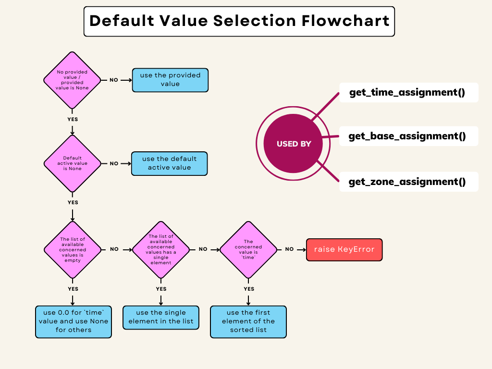

# Core concepts

PLAID is both a datamodel and a library implementing it. This page introduces the main concepts you’ll encounter when using PLAID to build datasets and learning problems.

(core-concept-dataset)=
## Dataset and on-disk format

A PLAID dataset is a collection of physics configurations, stored on disk in a human-readable, tool-friendly structure:

```
folder
├── dataset
│   ├── samples
│   │   ├── sample_000000000
│   │   │   ├── meshes/
│   │   │   │   ├── mesh_000000000.cgns
│   │   │   │   ├── mesh_000000001.cgns
│   │   │   └── scalars.csv
│   │   └── sample_yyyyyyyyy
│   └── infos.yaml
└── problem_definition
    ├── problem_infos.yaml
    └── split.json (or split.csv for <=0.1.7)
```

- `dataset/samples/`: one directory per sample.
- `meshes/`: CGNS files for time steps; can be explored in ParaView.
- `scalars.csv`: constant scalars for the sample.
- `problem_definition/`: learning task definition and splits.

(core-concept-sample)=
## Sample

`Sample` represents one observation. It may contain:
- scalars: name → value
- time series: name → (time_sequence, values)
- fields (on meshes): arrays at `Vertex`, `EdgeCenter`, `FaceCenter`, or `CellCenter`
- nodes: mesh node coordinates

Key APIs include:
- Feature accessors: {py:meth}`~Sample.get_scalar`, {py:meth}`~Sample.get_time_series`, {py:meth}`~Sample.get_field`, {py:meth}`~Sample.get_nodes`
- Feature updates: {py:meth}`~Sample.add_scalar`, {py:meth}`~Sample.add_time_series`, {py:meth}`~Sample.add_field`, {py:meth}`~Sample.set_nodes`, and high-level identifier-based updates
- Discovery: {py:meth}`~Sample.get_all_features_identifiers()` or {py:meth}`~Sample.get_all_features_identifiers_by_type()` to list all available features with their context

See also: {doc}`notebooks` for hands-on examples.

(core-concept-features)=
## Features and feature identifiers

PLAID uses feature identifiers to refer to features unambiguously (type + context such as base, zone, location, time). This is the preferred way to select inputs/outputs and manipulate data programmatically.

Start here for details and examples: {doc}`feature_identifiers`.

(core-concept-problem)=
## Problem definition

{py:class}`plaid.problem_definition.ProblemDefinition` gathers all the information defining a learning problem:
- task: e.g., regression or classification
- inputs: list of FeatureIdentifiers
- outputs: list of FeatureIdentifiers
- split: arbitrary named splits (train/val/test, etc.) stored as JSON

Typical usage:

```python
from plaid.problem_definition import ProblemDefinition
from plaid.types import FeatureIdentifier

pb = ProblemDefinition()
pb.set_task("regression")

pb.add_in_feature_identifier(FeatureIdentifier({"type": "scalar", "name": "Re"}))
pb.add_out_feature_identifier(FeatureIdentifier({
    "type": "field", "name": "pressure", "base_name": "Base", "zone_name": "Zone", "location": "Vertex", "time": 0.0
}))

splits = {"train": [0, 1, 2], "test": [3, 4]}
pb.set_split(splits)

pb._save_to_dir_("problem_definition")
```

{py:class}`~plaid.problem_definition.ProblemDefinition` supports filtering helpers to intersect existing inputs/outputs with a candidate list of identifiers.

(core-concept-defaults)=
## Default values mechanics

Some keys in identifiers (e.g., `base_name`, `zone_name`, `location`, `time`) can be omitted when defaults are configured or inferable. The defaulting behavior is described in this flowchart:



## Interoperability

- [CGNS standard](https://cgns.org/): the mesh/field containers align with CGNS conventions for bases, zones, elements and locations.
- Notebooks and pipelines: examples show data extraction to tabular arrays for scikit-learn blocks and more.
  - {doc}`notebooks/pipelines/pipeline_example`
  - {:py:class}`~plaid.pipelines.plaid_blocks`
  - {:py:class}`~plaid.pipelines.sklearn_block_wrappers`
